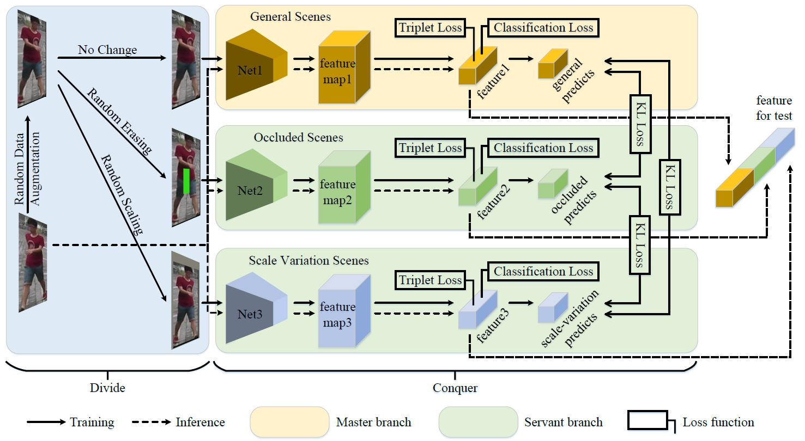

# Learning to Disentangle Scenes for Person Re-identification
   

Implementation of the proposed LDS. For the preprint version, please refer to [[Arxiv]](https://arxiv.org/pdf/2111.05476.pdf).
The complete code is available on https://git.openi.org.cn/zangxh/LDS.git.




## Getting Started
### Requirements
Here is a brief instruction for installing the experimental environment.
```
# install virtual envs
$ conda create -n LDS python=3.7 -y
$ conda activate LDS
# install pytorch 1.6.0 and other dependencies
```

### Download pre-trained model
The pre-trained vit model can be downloaded in this [link](https://pan.baidu.com/s/1xxIYNMRK7KNVThBxydTwJA)(code: 7qup) and should be put in the `/home/[USER]/.cache/torch/checkpoints/` directory.

## Training and Testing
```
$ python projects\LDS\train_net.py --config-file projects/LDS/configs/Market1501/LDS_3Branch_mutual.yml
```


## Results in the Paper
The results of Market1501, DukeMTMC-reID, MSMT17, P-DukeMTMC-reID, and Occluded DukeMTMC are provided below. 

| Model | Rank-1@Market1501 | Rank-1@DukeMTMC-reID | Rank-1@MSMT17 |Rank-1@P-DukeMTMC-reID |Rank-1@Occluded DukeMTMC |
| --- | --- | --- | --- | --- | --- |
| LDS | 95.84 | 91.56 | 86.54 | 91.96 | 64.39 |

You can download these models in this [link](https://pan.baidu.com/s/1_v_rR_8bqgruuuRS-H5XBQ)(code: huv8) and put them in the `WEIGHT` directory of the yml file. Then use the command below to evaluate them.
 ```
$ python projects\LDS\train_net.py --config-file projects/LDS/configs/Market1501/LDS_3Branch_mutual_test.yml
```


## Acknowledgement

This repository is built upon the repository [fast-reid](https://github.com/JDAI-CV/fast-reid).

## Citation
If you find this project useful for your research, please kindly cite:

```
@article{zang2021learning,
	author = {Xianghao Zang and Ge Li and Wei Gao and Xiujun Shu},
	title = {Learning to disentangle scenes for person re-identification},
	journal = {Image and Vision Computing},
	volume = {116},
	pages = {104330},
	year = {2021},
	issn = {0262-8856},
	doi = {10.1016/j.imavis.2021.104330}
}
```

## License
This repository is released under the GPL-2.0 License as found in the [LICENSE](LICENSE) file.
